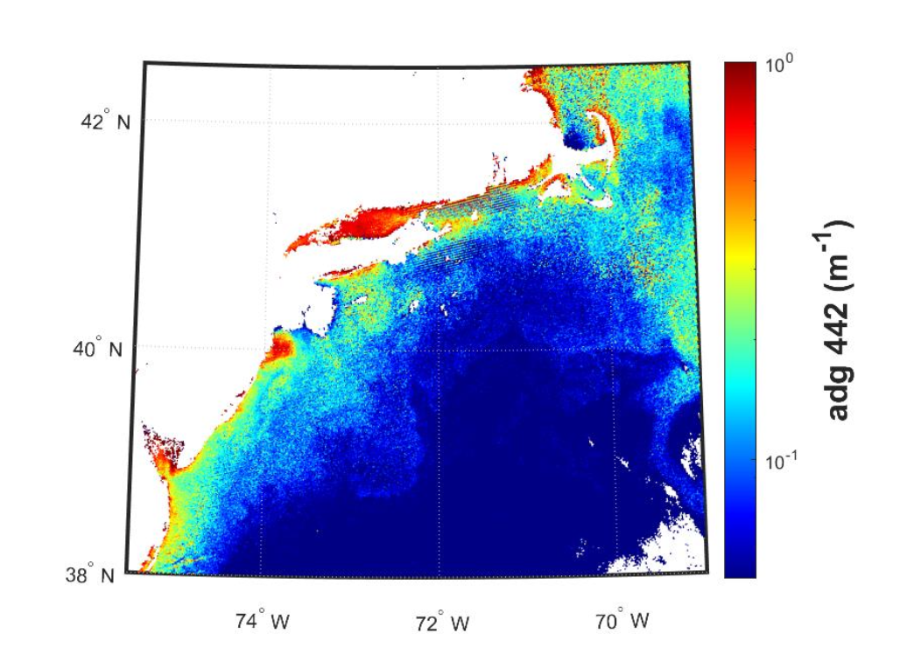

## What is it?

These absorption coefficients specifically define how light is absorbed by the combined effect of
non-living particles (detrital) and dissolved optically-active materials i.e. CDOM.

## How does it impact Aquaculture/Fisheries?

The increased absorption of light by detritus+CDOM can indicate the presence of a declining
phytoplankton bloom, or land-based detritus+CDOM from river input. In cases of known high river
discharge events (e.g. after a storm event or heavy rainfall or ice melt), this product is a useful
water mass tracer. CDOM has been found to be useful in source tracking of aquaculture as well
as wastewater pollution.

## What are the limitations/caveats?

While the algorithm is tunable, its standard configuration defines a constant “shape” of
detrital/CDOM absorption, so there is no information that can be derived about the origin of the
materials other than through subjective spatial-temporal context. Note, this is a combined detrital
matter + CDOM product, and not a standalone CDOM product (TBD).

## Does HYPERSPECTRAL directly improve/enable this product?

It does, in that it offers a full suite of adg coefficients across the visible spectrum. PACE Science and
Applications Team members are working to improve this product using new approaches to
radiative transfer as well as machine learning techniques. These improved products, including the
separation of ad (detritus) from ag (CDOM, or ‘gelbstoff’) are TBD.

