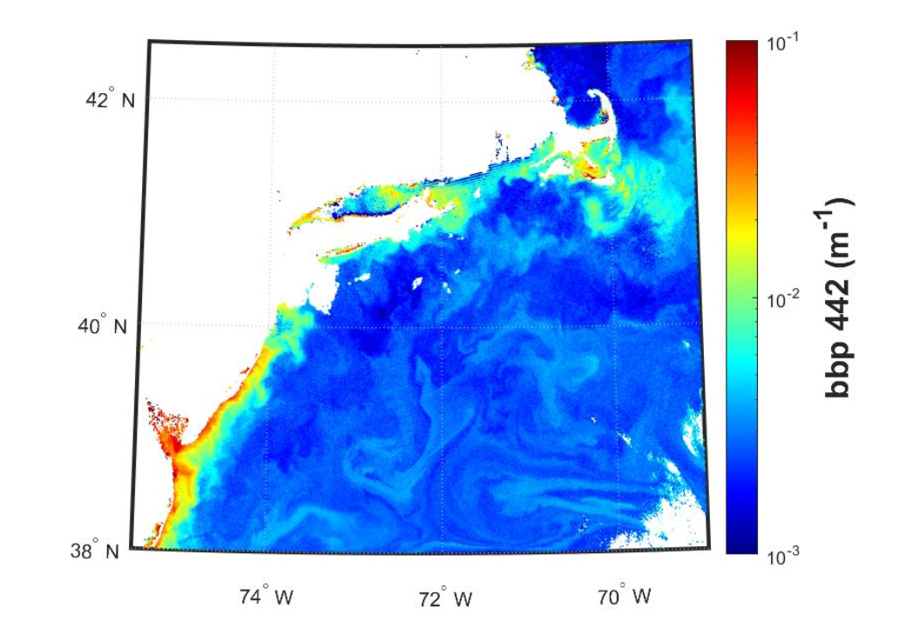

## What is it?

These backscatter coefficients specifically define how light is scattered in the backwards direction
by particles in the water. This product provides an indicator of the concentration of particles in
the ocean and a proxy indicator of particulate carbon concentrations.

## How does it impact Aquaculture/Fisheries?

Many phytoplankton exhibit unique backscattering characteristics, primarily as a function of cell
size, and sometime composition (e.g. Coccolithophore blooms). Backscatter is also used to derive
Particulate Inorganic Carbon (PIC) estimates from satellites. Particle backscatter is a particularly
useful tool to determine high sediment loads in nearshore environments, which tends to heavily
scatter light. High sediment loads can cause gill saturation in certain oyster species, and some fish
species exhibit hypersensitivity to suspended sediment. While not a direct measurement of
suspended particulate matter (SPM), it can be used to develop those products.

## What are the limitations/caveats?

The backscatter product is one of the most robust products offered in the “inherent optical
property (IOP)” suite of ocean color products. The only caveat is that the IOP algorithms can
sometimes fail to arrive at a solution (i.e. no data) in waters with extreme scattering or CDOM
concentrations. Nearshore environments present challenges in disentangling phytoplankton
backscatter from other optical constituents (re-suspended sediment, SPM, etc.).

## Does HYPERSPECTRAL directly improve/enable this product?

It does, in that it offers a full suite of bbp coefficients across the visible spectrum. PACE Science
and Applications Team members are working to improve this product using new approaches to
radiative transfer as well as machine learning techniques. These improved products are TBD.

