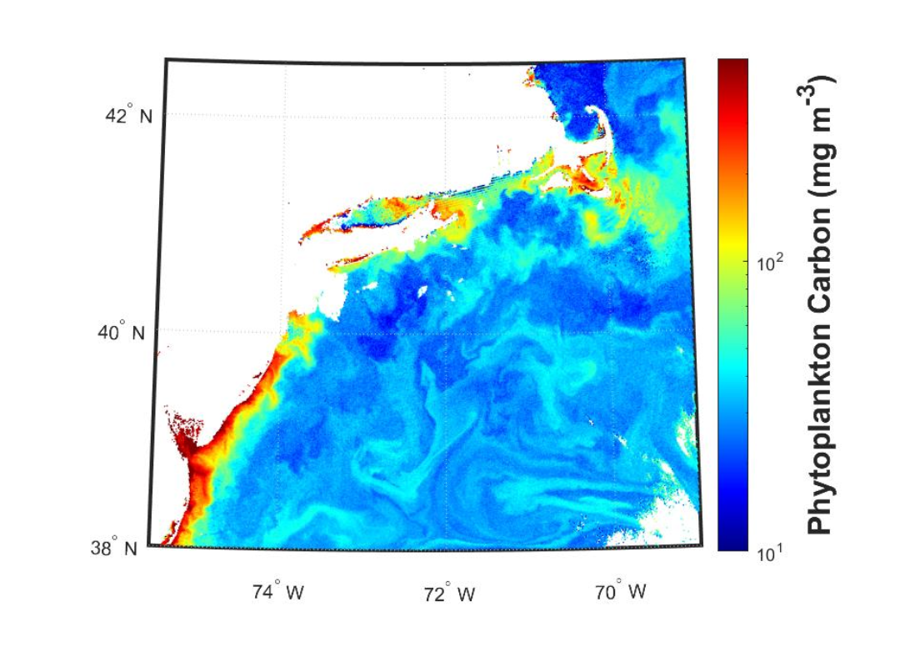

## What is it?

The phytoplankton carbon product expresses the concentration of phytoplankton in terms of
carbon concentration, instead of chlorophyll-a. Contrasting from the chlorophyll-a product,
phytoplankton carbon is derived from an empirical relationship to the particle backscattering
properties (see Product 6) of the water.

## How does it impact Aquaculture/Fisheries?

Some fisheries applications may prefer to work in units of carbon biomass instead of pigment-
based (i.e. chlorophyll-a) biomass. A constant chlorophyll-a value can represent a wide array of cell concentrations, due to environmental conditions and individual cell physiology/stress. For
example, individual phytoplankton can produce more chlorophyll-a/cell in low-light conditions
without changing the actual number of cells. The carbon product is not subject to these variations,
and is a more direct indicator of phytoplankton biomass. Modelers may also be interested in
computing the carbon to chlorophyll ratio, which can be obtained as carbon_phyto/chlor_a.

## What are the limitations/caveats?

This product was empirically tuned with field data, but it is not currently representative of
optically complex waters. The performance in coastal regions remains untested. This product
relies on the “inherent optical property (IOP)” suite of ocean color products, and thus can
sometimes fail to arrive at a solution (i.e. no data) in waters with extreme scattering or
chromophoric dissolved organic matter (CDOM) concentrations.

## Does HYPERSPECTRAL directly improve/enable this product?

Indirectly through improvements to the IOP products. PACE is the first mission to offer
phytoplankton carbon as a product under “provisional” status.

