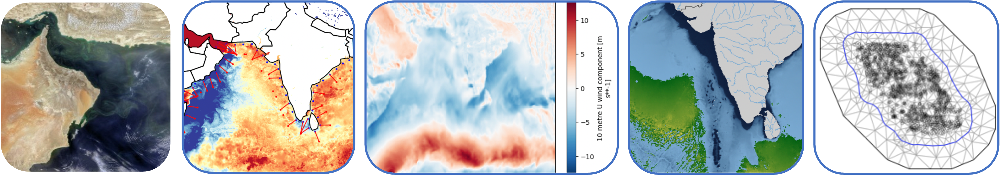
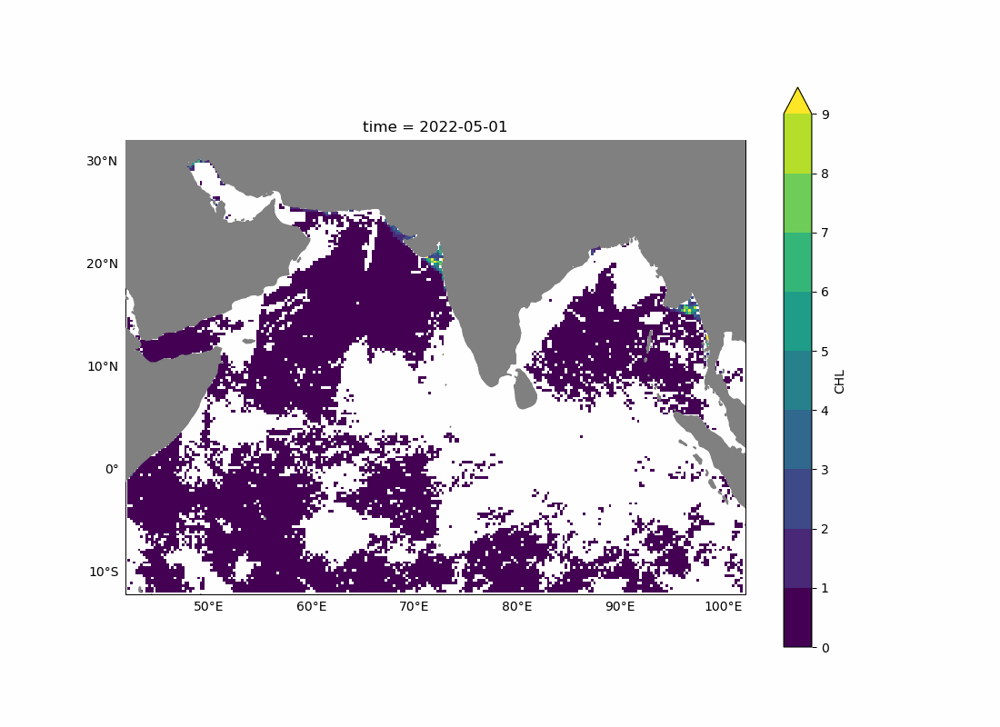

This summer's project relates to gap-filling (NAs) in remote-sensing data for chlorophyll. Why do gaps appear? Because the ocean color sensor cannot see through clouds. Why is this important? Chlorophyll-a is a key index of ocean productivity. Ocean color (after being processed through algorithms) produces an chlorophyll estimate but due to clouds there are still many gaps in the estimates. This animation shows the Arabian Sea in May 2022. White are clouds.

## How can machine-learning help?

## Goals of the project

The main goal is to show 'proof of concept' of deep-learning as a gap-filling approach and to compare different deep-learning algorithms for this task. The interns will compare the performance of different deep-learning algorithms and learn what kind of set-up and tuning is required for this task.

Additionally the goal is to develop tutorials to help others apply deep-learning to similar types of tasks or for this gap-filling task in different regions.

## Data set

We are using a analysis ready (zarr) file with a collection of ocean physical variables for the Indian Ocean. Why the Indian Ocean? It has a lot of clouds and there is a complex relationship between the physical variables and chlorophyll due to strong seasonal upwelling systems off the east coast of Africa (Somali upwelling system) and the southwest coast of India. Due to the different orientations of these coastlines, the relationship between wind and chlorophyll will be opposite and orthogonal. Coastal upwelling is driven by wind moving parallel to the coasts and these coasts face different directions (east versus west) and have different angles. 

The data set was mainly developed during the 2023 summer interns. You can read about the data here [Handbook on the Indian Ocean Zarr File](https://safs-varanasi-internship.github.io/indian-ocean-zarr/).

## Links

* GitHub org: <https://github.com/SAFS-Varanasi-Internship>
* JupyterHub: <https://fish.opensci.live/>
* Discussions: <https://github.com/SAFS-Varanasi-Internship/Summer-2024/discussions>
