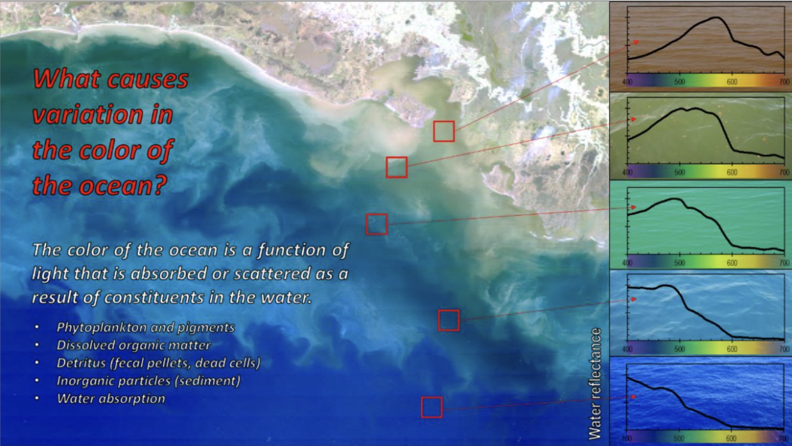

PACE Ocean products tell you about:

* WHAT IS THE COLOR OF THE OCEAN (Rrs)
* WHAT/WHO IS THERE (phytoplankton composition, SPM)
* HOW MUCH OF IT IS THERE (chlorophyll concentration, particulate/phytoplankton carbon etc.)
* ARE THEY SHINY/COLORFUL??? (IOPs)
* HOW MUCH LIGHT IS THERE (PAR/Kd)
* WHAT ARE THEY DOING (Primary productivity)
* HOW ARE THEY DOING (Fluorescence Line Height)

